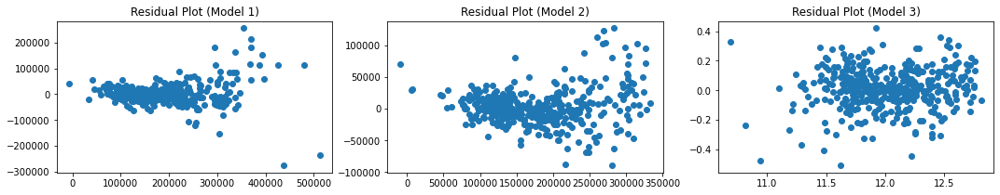

# Project 2 (Ames Housing Data)

### Problem Statement
Home sellers often anchor their offer price to avoid underselling, while home buyers, due to information asymmetry, often pay different prices for houses with similar features.

As a property consultancy firm, we aim to help residential home owners estimate the selling price of their homes by identifying the features that are most important to predict sales price. This would allow us to provide our clients with an easy tool that gives quick estimates of how much their homes are worth, and help them identify aspects of their properties they can improve on to increase their selling price.

### Contents
- [Problem Statement](#Problem-Statement)
- [Data Dictionary](#Data-Dictionary)
- [Modelling](#Modelling)
- [Conclusions and Recommendations](#Conclusions-and-Recommendations)

### Data Dictionary
I chose to narrow down to a small number of variables and to simplify many of the variables in the original dataset to binary variables (e.g. whether the house has a certain feature, such as a basement). This was because our aim is to provide clients with an easy tool that can give them quick estimates of how much their house is worth. As such, a key factor that influenced the selection of variables was whether it would be easy and quick for clients to fill in the fields needed to generate a prediction. The following features were thus chosen for the model:

|Feature|Description|
|---|---|
|**sale_price**|The price at which the house was sold.|
|**property_size**|The size of the house in square feet.|
|**overall_qual**|The quality of the material and finish of the house.|
|**overall_cond**|The condition of the house at the time it was sold.|
|**property_age**|The number of years since the house was first built at the time it was sold.|
|**num_floors**|The number of floors in the house.|
|**num_bedrooms**|The number of bedrooms in the house, not including basement bedrooms.|
|**num_full_baths**|The number of full bathrooms in the house, including those in the basement. Full bathrooms are bathrooms that contain a sink, a toilet, a shower, and a bathtub.|
|**num_half_baths**|The number of half bathrooms in the house, including those in the basement. Half bathrooms are bathrooms that contain a sink and toilet, but no bathing facilities.|
|**num_kitchens**|The number of kitchens in the house.|
|**num_fireplaces**|The number of fireplaces in the house.|
|**has_remodeled**|Binary variable representing whether the house has ever been remodeled.|
|**has_bsmt**|Binary variable representing whether the house has a finished basement.|
|**has_unf_bsmt**|Binary variable representing whether the house has an unfinished basement.|
|**has_garage**|Binary variable representing whether the house has a finished garage.|
|**has_unf_garage**|Binary variable representing whether the house has an unfinished garage.|
|**has_porch**|Binary variable representing whether the house has a porch or deck.|
|**has_fence**|Binary variable representing whether the house has a fence.|
|**has_pool**|Binary variable representing whether the house has a pool.|
|**near_road**|Binary variable representing whether the house is adjacent to or within 200' of an arterial or feeder road|
|**near_rail**|Binary variable representing whether the house is adjacent to or within 200' of a railway station.|
|**near_pos**|Binary variable representing whether the house is near a positive feature such as a park or greenbelt.|
|**area_(name)**|Dummy variables representing the neighborhood in which the house is located in.|

### Modelling
---
Regression models with and without penalty were used to try and predict sales price of residential properties. Model 1 was performed with all variables in the regression. The best performing model (the lasso regression) achieved an R2 of 77.78% on the test set. However, the residual plot demonstrated heteroscedasticity, which suggested the presence of outliers or a missing variable. A box plot of sales prices indicated that there were 29 outliers exceeding 3SD of the mean.

In Model 2, 29 outliers with sales price exceeding 3SD of the mean were dropped. The best performing model (the lasso regression) achieved an R2 of 84.75% on the test set. However, while the residual plot demonstrated reduced heteroscedasticity, there was still some level of heteroscedasticity, and the residual plot also seemed to show a non-linear, U-shaped trend. This seemed to indicate that the relationship between the variables and sales price was not linear.

Finally, Model 3 applied a logarithmic transformation to sale price, the dependent variable, and dropped coefficients that were reduced to zero in the previous lasso regression. These coefficients were: (1) being located in the South & West of Iowa State University, Greens, College Creek, or Veenker, (2) having an unfinished basement, (3) number of floors, (4) having a fence. The best performing model (the ridge regression) achieved an R2 of 88.74% on the test set. The resulting residual  plot no longer demonstrated heteroscedascity or a non-linear trend, indicating a good model fit.

||Model 1  (All Variables)|Model 2  (Dropped Outliers)|Model 3  (Log-transformed)|
|---|---|---|---|
|**No penalty**|80.87%|83.07%|84.91%|
|**Ridge penalty**|80.92%|83.09%|84.93%|
|**Lasso penalty**|80.99%|83.15%|84.89%|
|**Best train R2**|82.64%|84.50%|84.75%|
|**Best test R2**|77.78%|84.75%|88.74%|

 
 

### Conclusions and Recommendations
---
The best performing model was Model 3, achieving a test R2 score of 88.74%. Based on analysis of the coefficients, our recommendations for clients seeking to enhance the value of their homes are:

1. **The overall quality of building material and finish is the strongest indicator of selling price:** 
Clients should pay attention to material and finish when purchasing homes to maximize resale value. Clients may also consider refurbishing homes with better material and finishing to increase resale value.

2. **Older houses sell for much less than newer houses:** 
Clients should sell their houses when they are still new, and take care to purchase newer houses to maximize resale value.

3. **Overall condition of the house is a strong indicator of selling price.** 
Clients should take care to maintain the condition of the house to maximize resale value. If the condition of a house has deteriorated over time, the client should attempt to restore the condition of the house as much as possible before selling it.

4. **Larger houses sell for more.** 
Clients should purchase houses that come with larger plots of land. Extending the house if there are large areas of unused land will increase resale value.

5. **The number of bathrooms, bedrooms, and fireplaces are important.** 
Clients should take note of the number of bathrooms and bedrooms when purchasing a house. Building additional bathrooms and bedrooms if there is space can also increase resale value. Building another full bathroom is likely to result in the biggest increase in resale value, followed by building another bedroom, building another fireplace, and then building another half bathroom.

6. **Having a porch or a garage increases resale value, but an unfinished garage decreases resale value.**
Clients should try to buy a home with a porch and/or a garage, finished or unfinished. If the client's home has an unfinished garage, they should finish the garage before selling it to maximize resale value. If the home doesn't have a porch, the client can consider building a porch if there is unused land around the house.

7. **Being near a railway station or major road decreases resale value, but being near a park or greenbelt increases resale value.**
Clients should try to buy homes near greenery that are away from major roads and railway stations. It's possible that being near to major roads and railway stations results in noise pollution, which lowers the value of the property. An alternative explanation is that buyers in Ames City tend to prefer homes that are more secluded.

8. **Having a basement, a pool, or more than one kitchen is not guaranteed to increase resale value. Having more than one kitchen MAY in fact decrease resale value.**
In purchasing a house, clients who seek to maximize resale value should not pay too much attention to whether the house has a basement, pool, or more than one kitchen. If they have already purchased a house with extra kitchens, they may consider converting extra kitchens into bedrooms or bathrooms.

9. **Remodeling a house in itself is not guaranteed to increase resale value.**
If a client is seeking to increase the resale value of their home, they should try to purchase a house that has the previously-mentioned qualities. If they have already bought a home that has a suboptimal resale value, they should remodel strategically according to the previous recommendations.

10. **Location strongly affects the resale value of a house.**
Clients should purchase house in better neighborhoods. The best neighborhoods to own a house are Northridge Heights, Crawford, and Northridge. The worst neighborhoods to own a house are Briardale, Meadow Village, and Edwards.